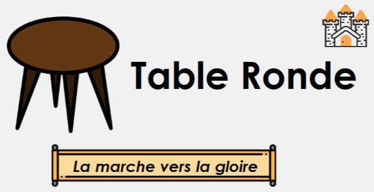
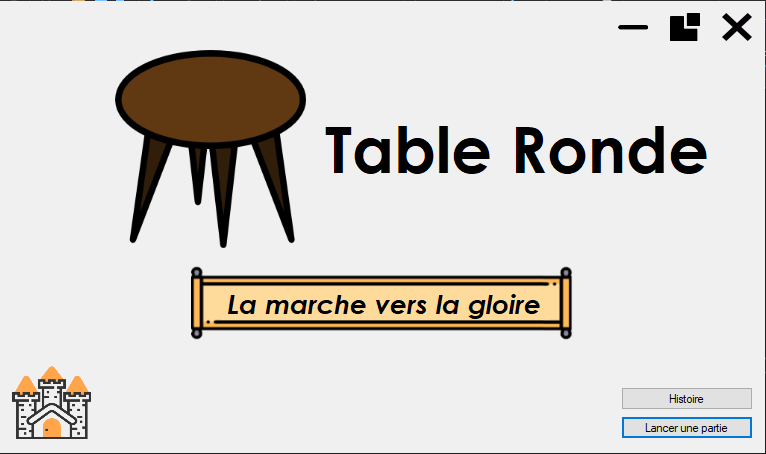
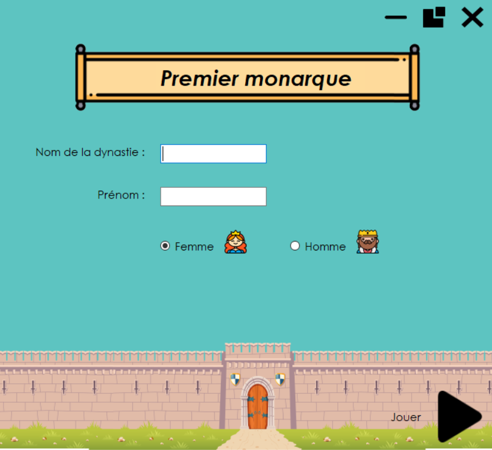
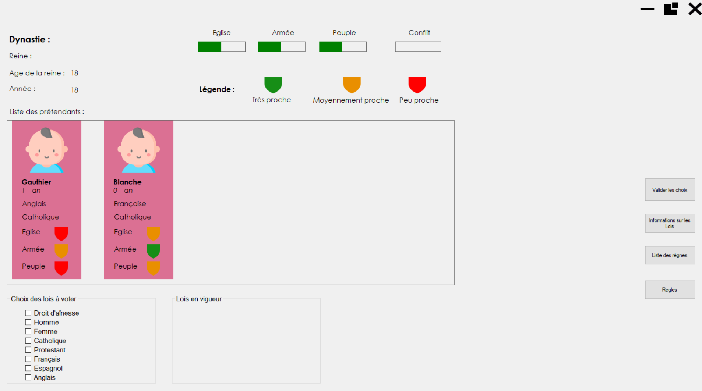
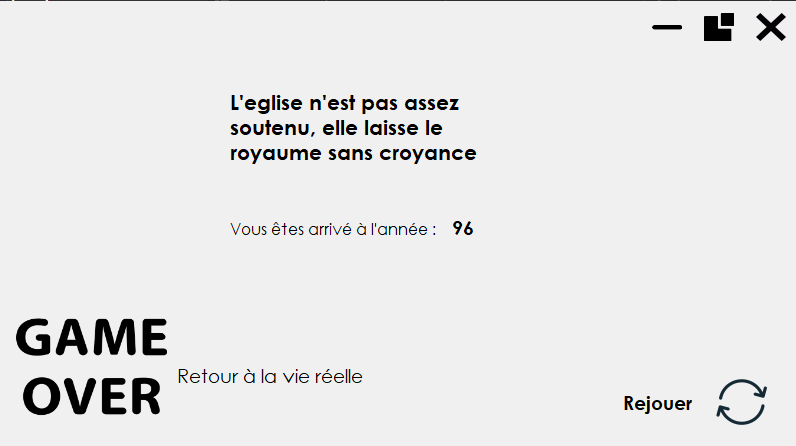

**Chef de projet :** :mortar_board:
* Julien Gossa

**Étudiants :** :school_satchel:
* Jean Miclo
* Léo Baumann
* Jules Fischer

## Introduction :notebook_with_decorative_cover:

Dans le cadre du projet tuteuré T3, il nous a été demandé de produire un jeu porté sur l’étude de la création des lois. L'objectif pédagogique principal de l’application est de faire comprendre au joueur que les lois n'ont rien d'absolu ou d'objectif et quelles sont le fruit de nombreuses contraintes. L’enjeu est donc d’instruire le joueur sur le procédé de création des lois de façon ludique.

## Ligne directive :chart_with_upwards_trend:

Nous nous sommes basés sur les travaux (T4) des S4 qui eux avaient directement parler aux intervenants. Après une analyse approfondie de leurs projets et notamment du cahier des charges, nous avons réunis assez d’informations et d’idée pour produire notre propre application.
Nous avons constaté que les projets T4 proposaient des mises en place de lois mais aucun moyen d’en retirer. C’est pourquoi nous avons de suite été enchanté par l’idée de le proposer dans notre application.

## Organisations :hourglass_flowing_sand:

A la place du milestone et issues nous avons utilisé un trello : [Trello](https://trello.com/b/BDwof6mO/t3)

## Fonctionnalités :white_check_mark:

* Le joueur peut accéder à une histoire autour du jeu via le boutton "Histoire"
* Le boutton "Lancer une partie" permet de commencer une partie

* L'utilisateur peux choisir le nom que portera la dynastie ainsi que le nom et le sexe du premier roi.
* Il peut aussi choisir le niveau de difficulté : 100,200,300 et sans limites

* Les choix impactent les différents jauges.
* Les héritiers sont colorés : rouge l'héritiers n'est pas le seul à répondre au contraintes des lois vert si l'héritier est le seul a répondre au contraintes et blanc si l'héritier ne réponds pas auw contraintes.
* La selection des lois est proposé à l'aide de checkbox. Des boutons permettent de valider les choix, avoir des précisions sur les lois, accéder aux les règles du jeu ainsi qu'au règnes des rois.
* Des naissances et décès sont implémentées.

* Fin de partie : le joueur est infomré de la raison pour laquelle il a perdu et peut relancer une partie grâce au bonton "rejouer".

## Logiciels et outils utilisés :wrench:

Dans un premier temps nous voulions coder le projet en Java mais après réflexion nous avons changé d’avis et avons codé l’application en C# pour un meilleur rendu graphique. Nous avons travaillé sur Windows/Ubuntu et avons utilisé l’IDE Visual Studio.

## Installation :computer:

L'installation ne pourra être effectué que sous windows via le lien suivant : [Table Ronde](https://git.unistra.fr/t432_ecr19_t3_b/tableronde)
